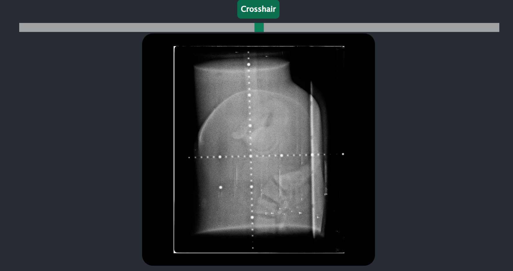
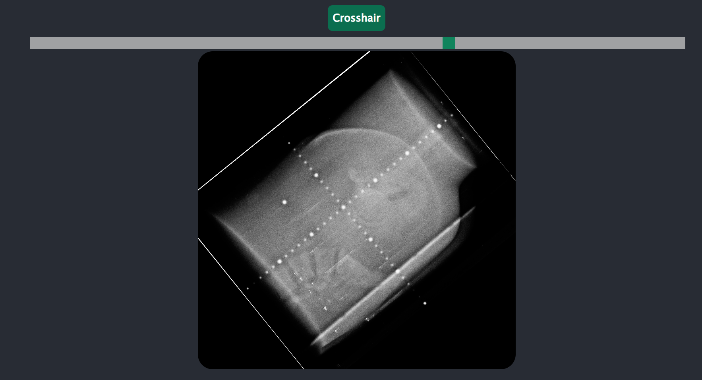
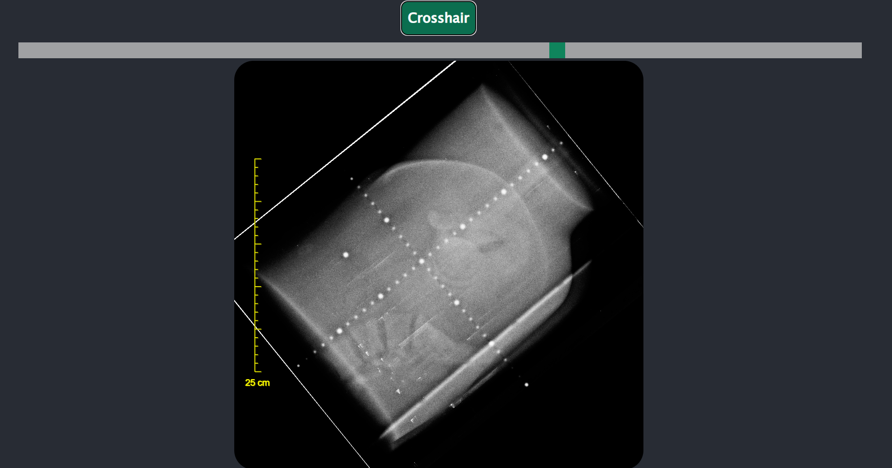
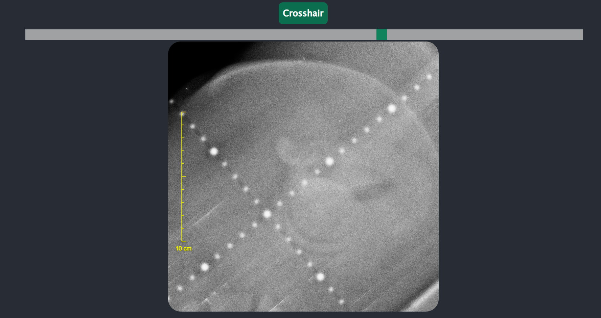

# Desafio de Programação para Estágio

Implementação de um vizualizador de imagens DCM, usando React.js e python, tudo rodando em forma de Contêiners Docker

### Layout:

### Features 
#### 1. Rotação da imagem

#### 2. Crosshair de régua

#### 3. Zoom com o botão direito

